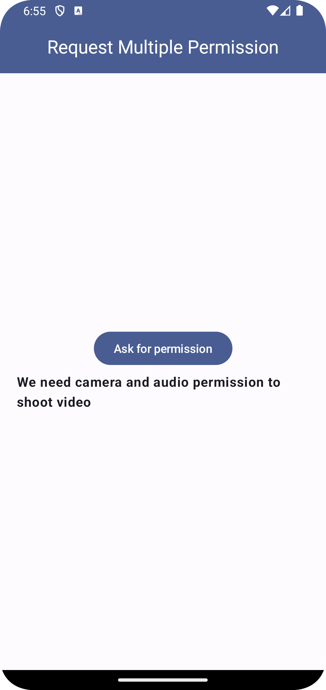
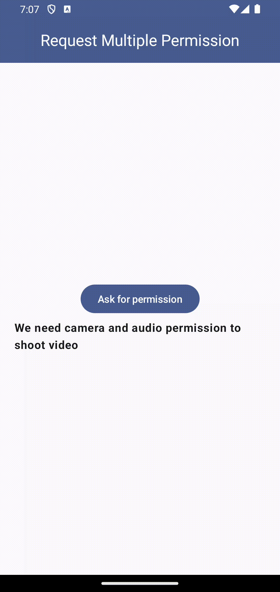

<!-- ---------- Header ---------- -->

[//]: # (  )
  <h1>Jetpack Compose Runtime Permission</h1>

Request Single or Multiple Runtime Permission Using Accompanist In Jetpack Compose

<!-- ---------- Description ---------- -->
## Features

- [x] Material Design 3
- [x] Request Single Permission
- [X] Request Multiple Permission
- [X] Permission Rationale
- [X] Written in Jetpack Compose

<!-- ---------- Download Release ---------- -->
## Download

<!-- ---------- Screenshots ---------- -->
## Screenshots
* App Design
* All Permissions Granted Usecase
* Permission Denied Usecase

  
  
  

<!-- ---------- Contribution ---------- -->
## Feedback and contributions
***All contributions are very welcome!***

* Bug reports and feature requests can be submitted [here](https://github.com/chiragthummar/JetpackComposeRequestPermissions/issues) (please make sure to fill out all the requested information properly!).
* If you are a developer and wish to contribute to the app, please **fork** the project and submit a [**pull request**](https://help.github.com/articles/about-pull-requests/).

## License

Record You is licensed under the [**GNU General Public License**](https://www.gnu.org/licenses/gpl.html): You can use, study and share it as you want.
